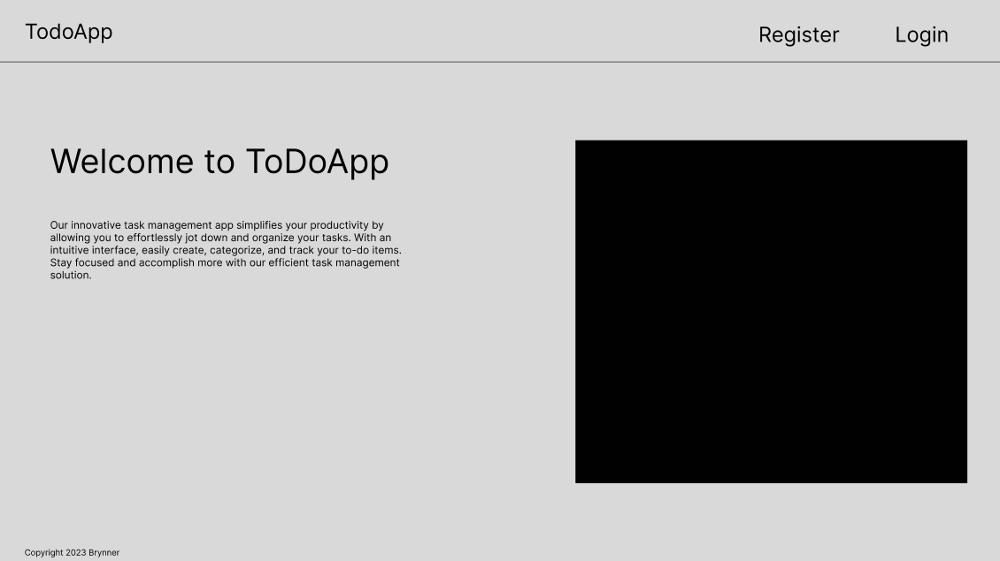
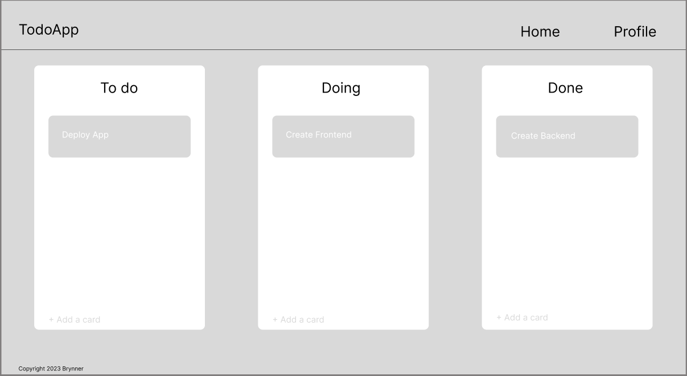

# ToDoApp Frontend

## Overview
ToDoApp is a simple task management application designed to help users organize and prioritize their tasks effectively. This repository contains the frontend code for the ToDoApp.

### Purpose
The purpose of the ToDoApp is to provide users with a user-friendly interface to manage their tasks and enhance their productivity. It allows users to create, update, and delete tasks, set due dates, and mark tasks as complete. The application aims to streamline task management and improve overall efficiency.

### Demo
You can access the deployed application [here](https://todoapp-production-51d5.up.railway.app/).

## Screenshots

## Getting Started
To run the ToDoApp frontend locally, follow these steps:

1. Clone the repository: `git clone https://github.com/BTodoApp/ToDoApp.git`
2. Install dependencies: `npm install`
3. Start the development server: `npm start`
4. Open the application in your browser at [http://localhost:3000](http://localhost:3000)

## Figma Wireframe

To view the Figma frontend wireframe, click [here](./image.png).

## Contact
For any inquiries or suggestions, feel free to reach out to me on [LinkedIn](https://www.linkedin.com/in/brynner-ventura/).
